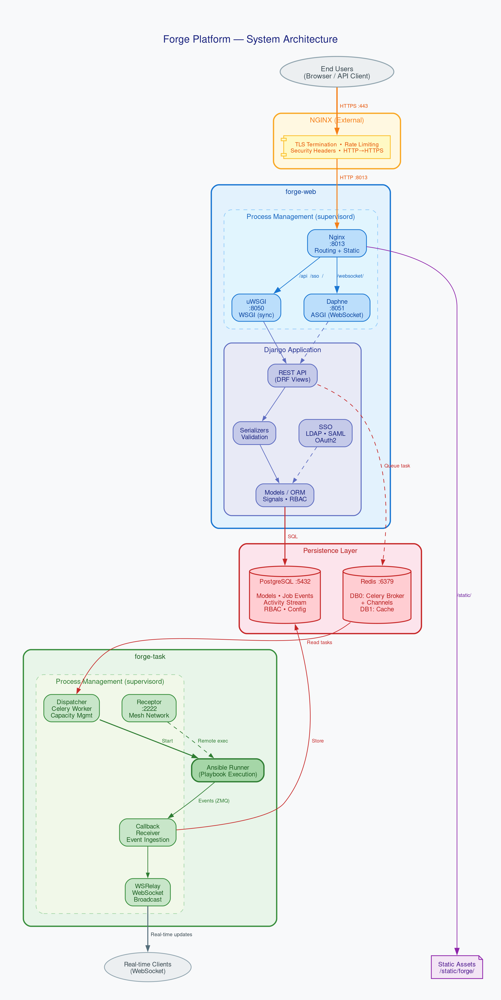

# 01 — Architecture Overview

## System Diagram



<details>
<summary>Text version (for terminals)</summary>

```
                        ┌─────────────────────────────────────────┐
                        │              End Users                   │
                        │         (Browser / API Client)           │
                        └────────────────┬────────────────────────┘
                                         │
                                    HTTPS (443)
                                         │
                        ┌────────────────▼────────────────────────┐
                        │            Nginx (External)              │
                        │   TLS termination, rate limiting,        │
                        │   security headers, HTTP→HTTPS redirect  │
                        └────────────────┬────────────────────────┘
                                         │
                                    HTTP (8013)
                                         │
              ┌──────────────────────────▼──────────────────────────┐
              │                Nginx (Internal)                      │
              │        Routes requests to correct backend            │
              ├──────────────┬──────────────────┬───────────────────┤
              │  /static/    │  /api/, /sso/,   │  /websocket/      │
              │  (files)     │  / (pages)       │  (real-time)      │
              └──────┬───────┴────────┬─────────┴──────┬────────────┘
                     │                │                 │
              Static files      uWSGI (8050)      Daphne (8051)
              /var/lib/awx/     Django WSGI       Django ASGI
              public/static/    (sync HTTP)       (WebSocket)
                                     │                 │
              ┌──────────────────────▼─────────────────▼────────────┐
              │                  Django Application                   │
              │   REST API ─── Serializers ─── Models ─── Database   │
              └──────────────────────┬───────────────────────────────┘
                                     │
                    ┌────────────────▼────────┐
                    │     PostgreSQL (5432)    │
                    └─────────────────────────┘

              ┌──────────────────────────────────────────────────────┐
              │                  Task Container                       │
              │                                                       │
              │   Dispatcher ──► Ansible Runner ──► Callback Receiver │
              │       │                                  │            │
              │       │              Receptor            WSRelay      │
              │       │           (mesh networking)         │         │
              └───────┼────────────────────────────────────┼─────────┘
                      │                                    │
                      ▼                                    ▼
                ┌──────────┐                        ┌──────────────┐
                │  Redis   │                        │  WebSocket   │
                │  (6379)  │                        │  Clients     │
                └──────────┘                        └──────────────┘
```

</details>

---

## Component Roles

### Web Container (`forge-web`)

Handles all HTTP and WebSocket traffic. Runs three processes via `supervisord`:

| Process | Port | Purpose |
|---------|------|---------|
| Nginx (internal) | 8013 | Routes requests, serves static files |
| uWSGI | 8050 | Django app — API, pages, authentication |
| Daphne | 8051 | WebSocket connections for real-time updates |

**Watch out:** Internal Nginx is inside the container and handles routing. External Nginx
is a separate container that terminates TLS. Don't confuse them — configuration lives in
two different files:
- External: `tools/docker-compose-prod/nginx/nginx.conf`
- Internal: `tools/docker-compose-prod/settings/nginx-internal.conf`

### Task Container (`forge-task`)

Handles background job execution. Runs four processes:

| Process | Purpose |
|---------|---------|
| **Dispatcher** | Picks tasks from Redis, manages capacity, starts jobs |
| **Callback Receiver** | Receives events from Ansible Runner, saves to database |
| **WSRelay** | Broadcasts job events to WebSocket clients |
| **Receptor** | Mesh networking for remote job execution |

**Watch out:** If any of these 4 processes goes down, jobs won't work correctly.
Check with `supervisorctl status` inside the container.

### PostgreSQL

Stores all data: models, job events (partitioned), activity stream, RBAC roles,
configuration. Job events are in a **partitioned table** — one partition per job,
which is critical for performance since a single job can have tens of thousands of events.

### Redis

Used for two purposes:
- **DB 0:** Celery message broker + Django Channels (WebSocket)
- **DB 1:** Cache (API response caching, rate limiting)

**Watch out:** If Redis goes down, jobs won't start and WebSocket won't work.
However, data in PostgreSQL remains safe.

### Receptor

Mesh networking for distributed job execution. In a single-node deployment
(default), Receptor runs locally. In a multi-node setup, it routes jobs to
remote execution nodes over TCP port 2222.

---

## Request Flow — What happens when...

### ...a user launches a job template

1. User clicks "Launch" in the UI or sends POST to `/api/v2/job_templates/{id}/launch/`
2. Django creates a `Job` record in the database with status `pending`
3. A Celery task is placed in the Redis queue
4. Dispatcher picks up the task and transitions the job to `waiting` → `running`
5. Ansible Runner executes the playbook
6. Events flow: Runner → Callback Receiver → database + WSRelay → WebSocket → browser
7. Browser receives events and updates the UI in real-time (no page refresh needed)

### ...an external system sends a webhook (EDA)

1. External system (GitHub, Alertmanager, etc.) sends POST to `/api/v2/eda_webhooks/<path>/`
2. Nginx forwards to uWSGI (no authentication required on this endpoint)
3. Django verifies the HMAC signature against the EventRule's webhook key
4. An `EventLog` record is created with status `received`
5. A Celery task is dispatched for async rule evaluation
6. The Celery task evaluates Jinja2 conditions against the webhook payload
7. If conditions match: launches job templates, workflows, or sends notifications
8. `EventLog` is updated with results; `AuditEvent` is created for compliance
9. Caller receives `202 Accepted` immediately (processing is async)

### ...a user opens a page in the browser

1. Browser sends a GET request
2. Nginx terminates TLS, forwards to internal Nginx (8013)
3. Internal Nginx:
   - `/static/*` → serves files directly from disk
   - `/websocket/*` → proxies to Daphne (8051)
   - Everything else → proxies to uWSGI (8050)
4. Django processes the request: middleware → URL routing → view → serializer → response

---

## Port Reference

| Port | Service | Description |
|------|---------|-------------|
| 443 | Nginx (external) | HTTPS entry point for users |
| 80 | Nginx (external) | HTTP → redirect to HTTPS |
| 8013 | Nginx (internal) | Internal routing (within Docker network) |
| 8050 | uWSGI | Django sync application |
| 8051 | Daphne | Django async (WebSocket) |
| 5432 | PostgreSQL | Database |
| 6379 | Redis | Broker + cache |
| 2222 | Receptor | Mesh networking |

**Watch out:** Ports 8050 and 8051 are not externally accessible — only internal Nginx
on 8013 communicates with them. Do not expose 8050/8051 outside the Docker network.

---

## Directory Structure — Where things live

```
forge/                          # Python backend
├── api/                        # REST API (views, serializers, urls)
├── main/                       # Core (models, tasks, signals, migrations, commands)
├── conf/                       # Database-backed settings
├── settings/                   # Django settings files
├── sso/                        # SSO authentication backends
└── ui_next/                    # React frontend

tools/
├── docker-compose-prod/        # Production deployment
│   ├── docker-compose.yml      # 6 services
│   ├── .env                    # Environment variables
│   ├── settings/               # Django settings for production
│   ├── nginx/                  # Nginx config + SSL certificates
│   ├── receptor/               # Receptor mesh config
│   └── scripts/                # Init, backup, healthcheck
├── ansible/roles/dockerfile/   # Dockerfile generation
└── scripts/                    # Vagrant provisioning

requirements/                   # Python dependencies
```

---

## Key Design Decisions

### Why two Nginx instances?

Internal Nginx is part of the Docker image and routes requests to uWSGI/Daphne.
External Nginx is a separate container that handles TLS termination, rate limiting,
and security headers. This separation allows the external Nginx to be replaced
with a load balancer (HAProxy, AWS ALB) without changing the application.

### Why partitioned job events?

A single job with 100 hosts and 50 tasks generates ~5,000 events. A system running
100 jobs daily has ~500,000 events per day. Without partitioning, every query would
scan the entire table. With partitioning, a query for a specific job reads only
one partition.

### Why Receptor instead of SSH?

Receptor provides mesh networking — hop-by-hop routing for air-gapped environments,
automatic failover, and multiplexing. SSH requires a direct connection to every
node, which doesn't work in complex network topologies.

### Why database-backed settings?

Most settings can be changed without restarting the application via the API
(`/api/v2/settings/`). This is critical for production where you don't want
downtime to change a timeout or add an LDAP server.
