# Forge Platform — User Handbook

A step-by-step guide for everyday use of the Forge Platform UI. Each section follows the left sidebar of the application. Click any item in the table of contents to jump straight to it.

---

## Table of Contents

### Views
- [Dashboard](#dashboard)
- [Jobs](#jobs)
- [Schedules](#schedules)
- [Activity](#activity)
- [Audit Log](#audit-log)
- [Analytics](#analytics)

### Automation
- [Event Rules](#event-rules)
- [Event Logs](#event-logs)
- [Outbound Webhooks](#outbound-webhooks)

### Self-Service
- [Service Portal](#service-portal)
- [My Requests](#my-requests)
- [Approvals](#approvals)
- [Catalog Admin](#catalog-admin)

### Tenancy
- [Tenants](#tenants)
- [Quota Events](#quota-events)

### Compliance
- [Drift Detections](#drift-detections)
- [Drift Alerts](#drift-alerts)
- [Alert Rules](#alert-rules)
- [Fact Snapshots](#fact-snapshots)
- [Policies](#policies)
- [Policy Decisions](#policy-decisions)
- [Scanners](#scanners)
- [Scan Results](#scan-results)
- [Observability](#observability)

### Resources
- [Templates](#templates)
- [Inventories](#inventories)
- [Hosts](#hosts)
- [Projects](#projects)
- [Credentials](#credentials)

### Access
- [Organizations](#organizations)
- [Users](#users)
- [Teams](#teams)

### Admin
- [Instances](#instances)
- [Instance Groups](#instance-groups)
- [Execution Environments](#execution-environments)
- [Notifications](#notifications)
- [Topology](#topology)
- [Settings](#settings)

---

# VIEWS

## Dashboard

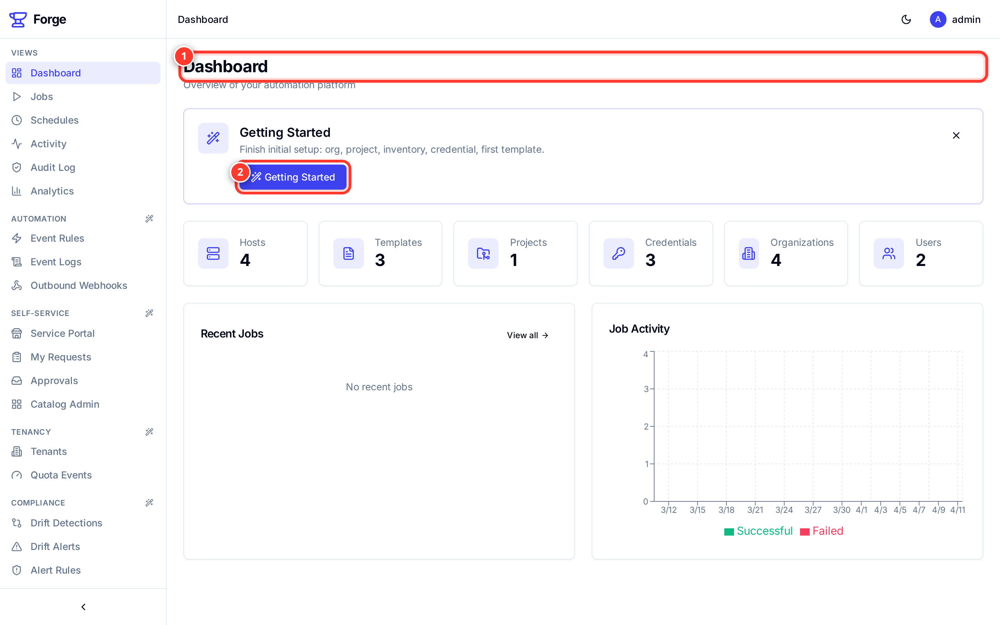

**What each marker means:**

1. **Page heading** — confirms you are on the Dashboard.
2. **Getting Started banner** — links to the wizard that walks you through the first install (org, project, inventory, credential, template).

The Dashboard is the landing page after login. It shows the overall health of the platform: recent jobs, success/failure rates, active hosts, and quick links.

**Step by step**

1. Log in to Forge.
2. You will land on the Dashboard automatically. If not, click **Dashboard** in the left sidebar.
3. Read the four top tiles: *Total Hosts*, *Total Jobs*, *Active Schedules*, *Recent Failures*.
4. Use the time-range selector (top-right) to switch between **Last 24h**, **Last 7d**, **Last 30d**.
5. Click any tile to drill into the matching list view.

**Example**

> Open Dashboard → set range to **Last 7d** → click the *Recent Failures* tile to see all failed jobs of the past week.

---

## Jobs

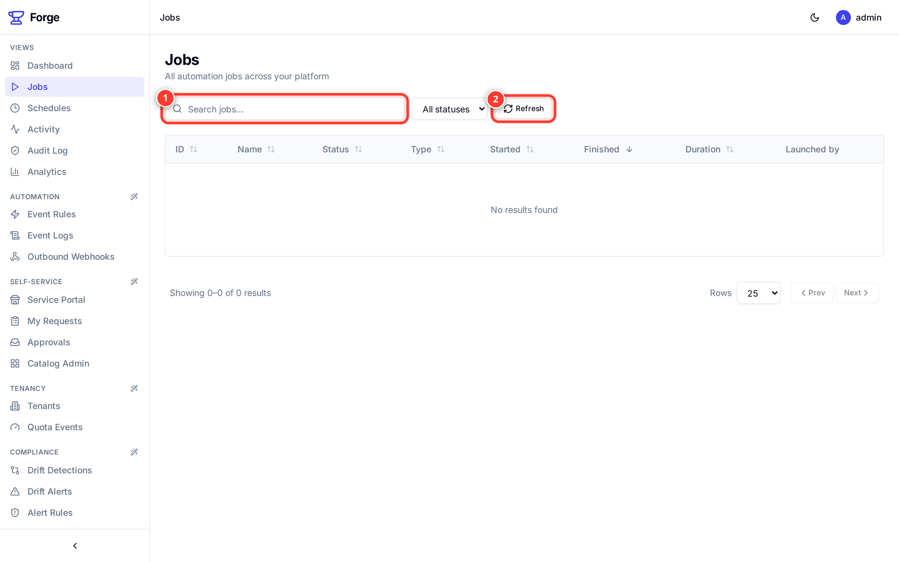

**What each marker means:**

1. **Search box** — filter the jobs list by name or id, e.g. type `Deploy` to find every run of the Deploy Webapp template.
2. **Refresh** — re-fetch the list (auto-refresh runs on a timer too).

Jobs are individual runs of a Job Template. Use this view to launch, monitor, and inspect playbook executions.

**Step by step — launch a job**

1. Click **Jobs** in the sidebar.
2. Click the **Launch** button (top-right).
3. Pick a **Job Template** from the dropdown.
4. Fill in any required survey variables.
5. Click **Launch**.
6. The job opens in the live output view — watch the play-by-play log.

**Example survey input**

```yaml
target_env: staging
package_version: 1.4.2
restart_service: true
```

**Step by step — inspect a finished job**

1. Click any row in the Jobs list.
2. Read the **Details** tab (status, duration, executed by).
3. Open the **Output** tab for the full Ansible log.
4. Open **Hosts** to see per-host success/failure.

---

## Schedules

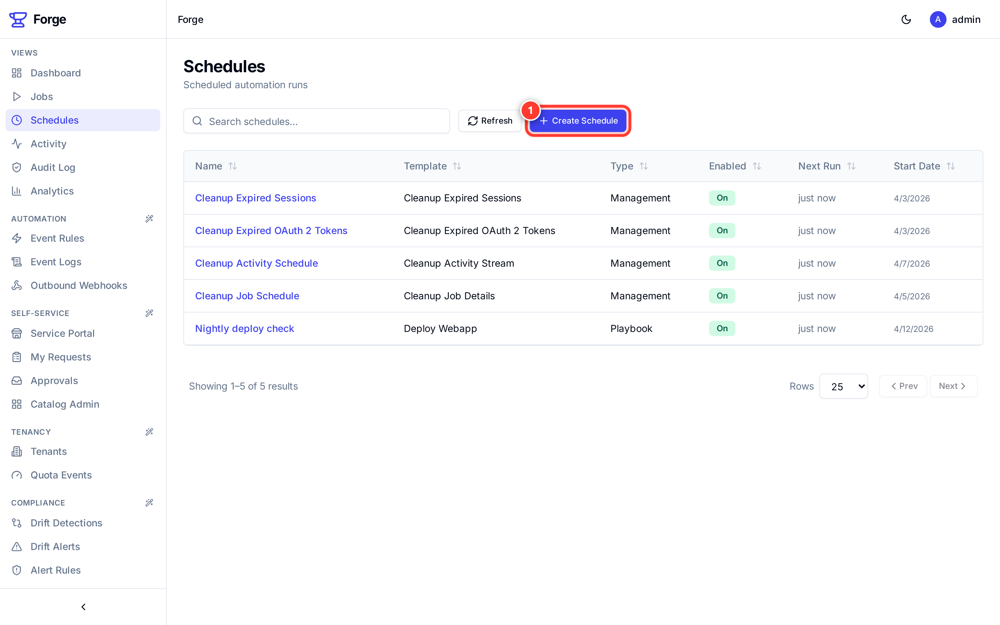

**What each marker means:**

1. **Create Schedule** — opens the form below.

Schedules trigger Job Templates automatically on a cron-like cadence.

**Create Schedule**

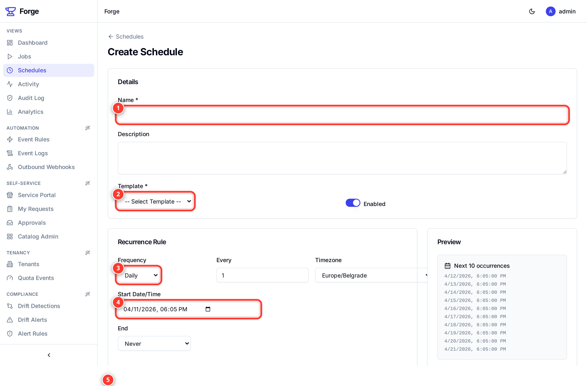

**What each marker means:**

1. **Name** — short, descriptive id, e.g. `nightly-db-backup`.
2. **Template** — the Job Template to launch on the schedule, e.g. `Backup PostgreSQL`.
3. **Frequency** — None / Minute / Hour / Day / Week / Month — pick the cadence.
4. **Start Date/Time** — when the first run should fire, e.g. `2026-04-12 02:00`.
5. **Create Schedule** — submits the form.

**Step by step**

1. Click **Schedules** → **Add**.
2. Fill in:
   - **Name** — short, descriptive
   - **Job Template** — what to run
   - **Start Date / Time**
   - **Frequency** — None / Minute / Hour / Day / Week / Month
   - **Repeat Frequency** — every *N* of the chosen unit
3. Click **Save**.
4. Toggle the **Enabled** switch to activate.

**Example**

| Field | Value |
|---|---|
| Name | `nightly-db-backup` |
| Job Template | `Backup PostgreSQL` |
| Start Date | `2026-04-12 02:00` |
| Frequency | Day |
| Repeat | every `1` day |

---

## Activity

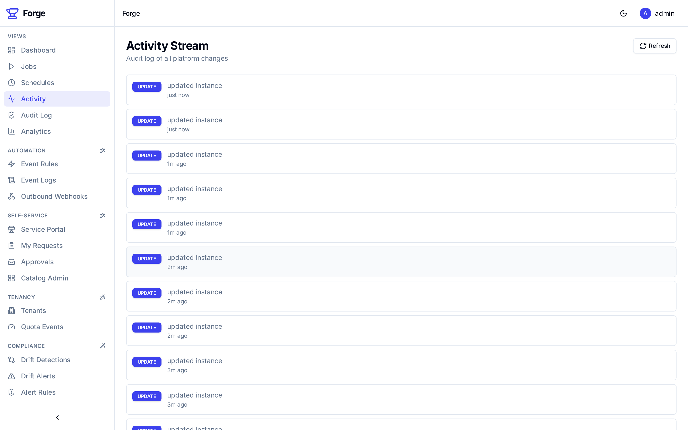

**What each marker means:**

1. **Page heading** — Activity is read-only; use the column headers and filters to narrow the feed.

A chronological feed of platform actions: who did what and when.

**Step by step**

1. Click **Activity**.
2. Filter by **User**, **Object Type**, or **Date Range**.
3. Click any row to open the actor and the affected object side by side.

**Example**

> Filter: User = `alice`, Date Range = *Today* → see every change Alice made today.

---

## Audit Log

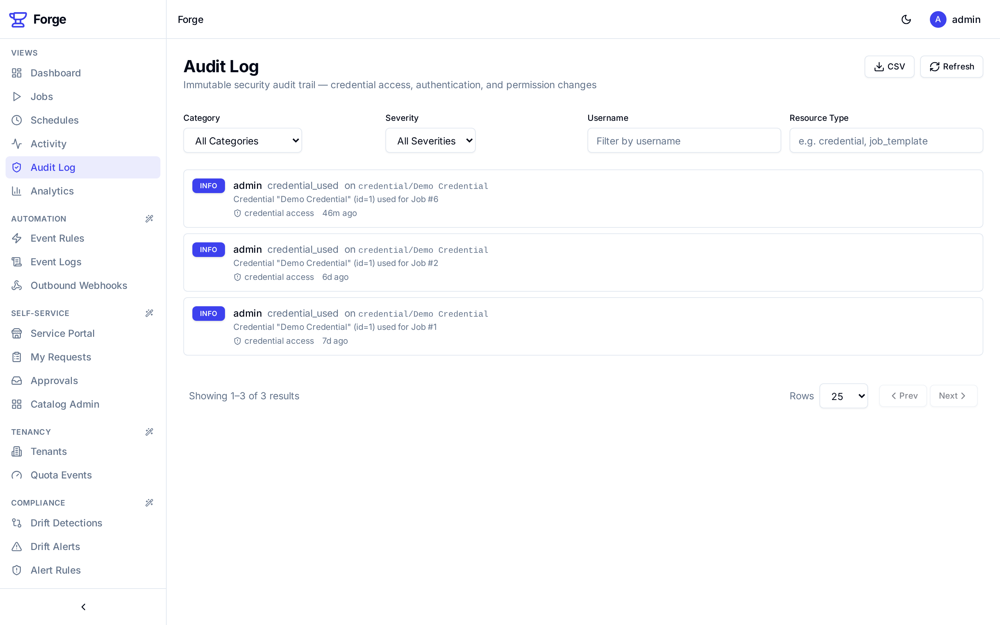

**What each marker means:**

1. **Page heading** — use the column header filters to narrow by event type, severity, actor, or date range.

Tamper-evident security log used for compliance reporting (SOC 2, ISO 27001).

**Step by step**

1. Click **Audit Log**.
2. Use filters: **Event Type** (`login`, `permission_change`, `credential_access`, …), **Severity**, **Actor**.
3. Click **Export → CSV** to download for audit.

**Example**

> Filter: Event Type = `credential_access`, Date Range = *Last 30d* → export CSV → attach to audit ticket.

---

## Analytics

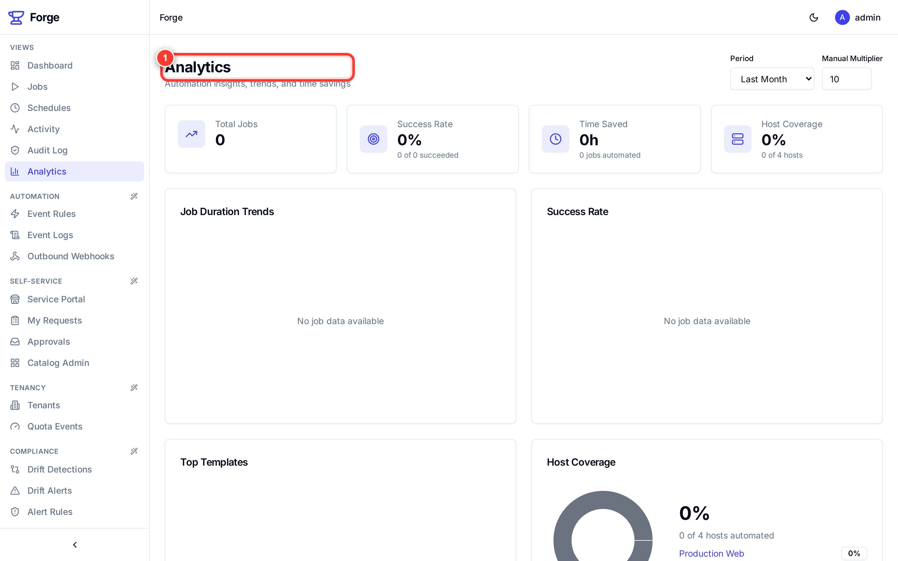

**What each marker means:**

1. **Page heading** — switch tabs across the top to see Overview / Job Trends / Host Health / Top Failures.

Visual KPIs across the whole platform: job throughput, MTTR, top failing templates.

**Step by step**

1. Click **Analytics**.
2. Pick a tab: **Overview**, **Job Trends**, **Host Health**, **Top Failures**.
3. Hover any chart point for the exact number.
4. Click **Download Report → PDF** for a printable snapshot.

**Example**

> Open *Top Failures* → identify the template with most failures → click it → land on its Jobs list filtered to failed runs.

---

# AUTOMATION

## Event Rules

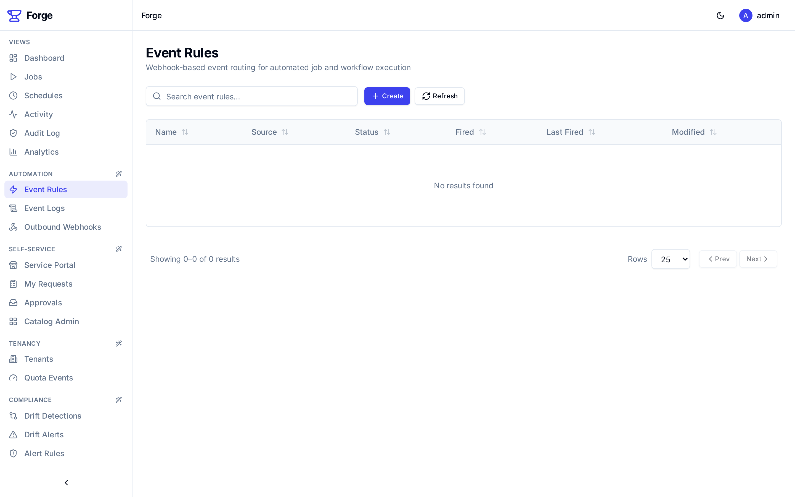

**What each marker means:**

1. **Create Event Rule** — opens the form below.

Event Rules listen for incoming events (webhooks, alerts, message bus) and launch a Job Template when conditions match.

**Create Event Rule**

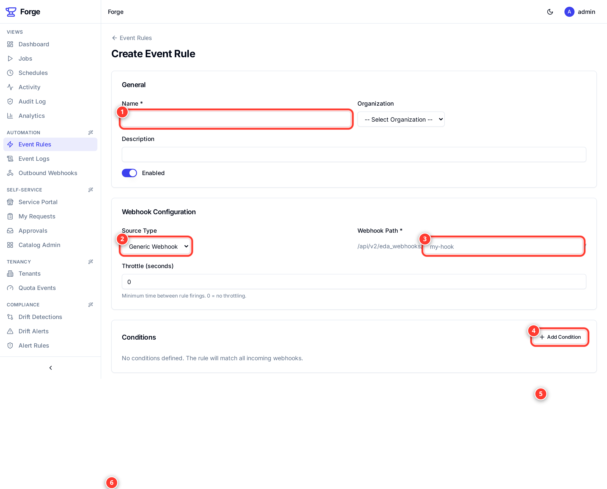

**What each marker means:**

1. **Name** — short id, e.g. `restart-on-prometheus-crit`.
2. **Source Type** — webhook / kafka / alertmanager / etc.
3. **Webhook Path** — URL suffix the source will hit, e.g. `/prom-crit`.
4. **Add Condition** — add JSONPath / regex match rules.
5. **Add Action** — what to launch when conditions match (Job Template, Workflow).
6. **Create Event Rule** — submits the form.

**Step by step**

1. Click **Event Rules** → **Create Rule**.
2. Fill in:
   - **Name**
   - **Source** (webhook, kafka, prometheus alertmanager, …)
   - **Match condition** (JSONPath / regex)
   - **Action** — Job Template to launch
   - **Variables to forward**
3. Click **Save** → toggle **Enabled**.

**Example**

```yaml
name: restart-on-prometheus-crit
source: alertmanager
match: "$.alerts[?(@.labels.severity=='critical')]"
action_template: Restart Failed Service
forward_vars:
  host: "{{ alert.labels.instance }}"
  service: "{{ alert.labels.service }}"
```

---

## Event Logs

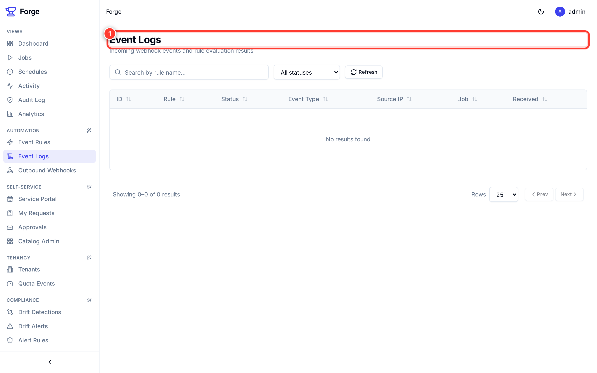

**What each marker means:**

1. **Page heading** — read-only feed of received events; click a row to see the raw payload.

Read-only history of every event the platform received and what rule (if any) consumed it.

**Step by step**

1. Click **Event Logs**.
2. Filter by **Source**, **Status** (`matched`, `unmatched`, `error`), **Date**.
3. Click a row to see the raw event payload and which rule fired.

**Example**

> Filter: Status = `unmatched` → find events nothing reacted to → write a new Event Rule for them.

---

## Outbound Webhooks

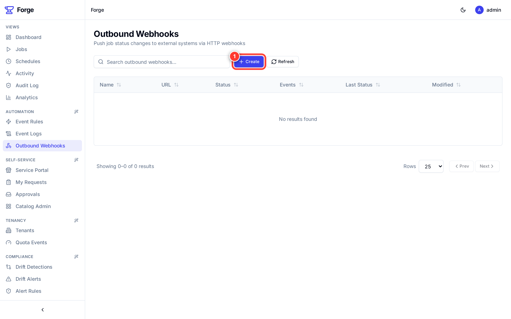

**What each marker means:**

1. **Create Outbound Webhook** — opens the form below.

Send platform events to external systems (Slack, PagerDuty, ServiceNow).

**Create Outbound Webhook**

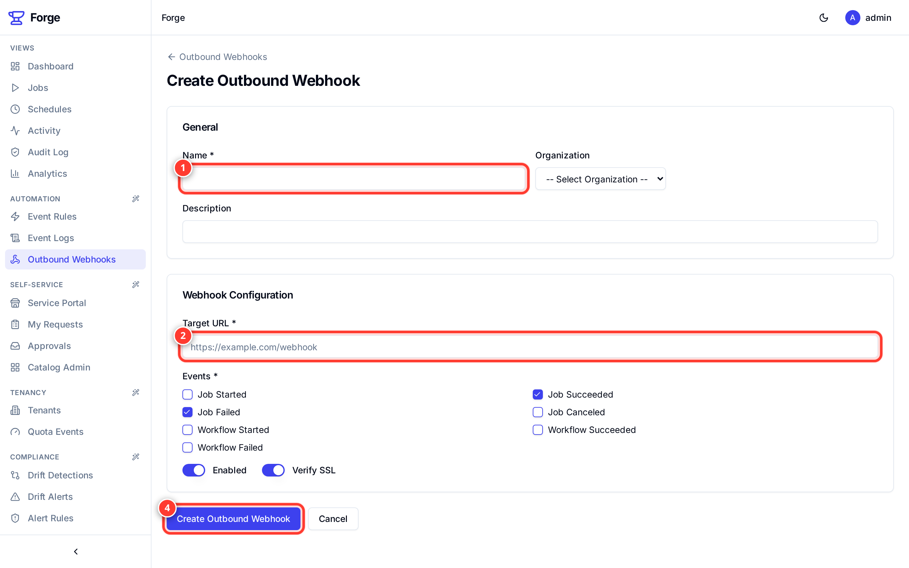

**What each marker means:**

1. **Name** — short id, e.g. `slack-failed-jobs`.
2. **Target URL** — full https URL of the receiving endpoint, e.g. `https://hooks.slack.com/services/T0/B0/XYZ`.
3. **Trigger toggles** (Job Started / Succeeded / Failed / etc.) — pick which events fire the webhook.
4. **Create Outbound Webhook** — submits the form.

**Step by step**

1. Click **Outbound Webhooks** → **Add**.
2. Fill in:
   - **Name**
   - **Target URL**
   - **HTTP Method** (POST / PUT)
   - **Headers** (auth tokens)
   - **Trigger Events** (job-failed, job-success, drift-detected, …)
   - **Payload Template** (Jinja2)
3. Click **Test** → **Save**.

**Example**

```yaml
name: slack-failed-jobs
url: https://hooks.slack.com/services/T0/B0/XYZ
method: POST
headers:
  Content-Type: application/json
trigger: job_failed
payload: |
  {"text": ":x: Job *{{ job.name }}* failed on {{ job.host }}"}
```

---

# SELF-SERVICE

## Service Portal

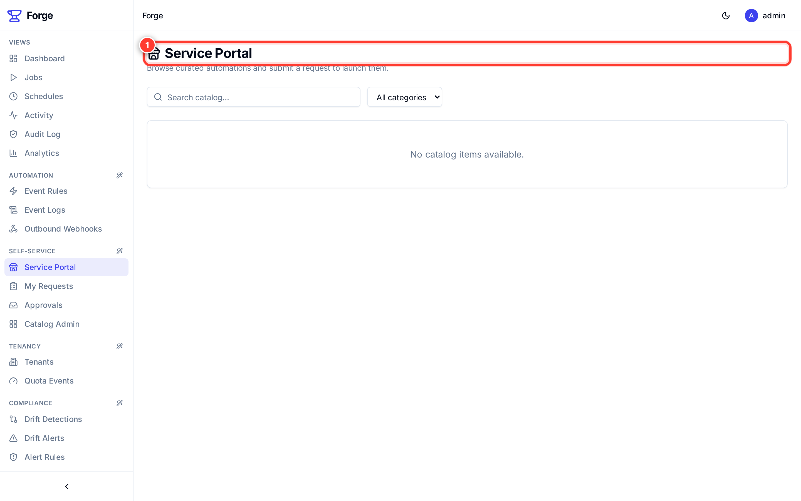

**What each marker means:**

1. **Page heading** — end-user catalog. Browse tiles or use search.

End-user catalog: lets non-admins request pre-approved automations without touching templates directly.

**Step by step (as end user)**

1. Click **Service Portal**.
2. Browse the catalog tiles or use the search bar.
3. Click a tile (e.g., *New Dev VM*).
4. Fill in the request form.
5. Click **Submit**.

**Example form**

| Field | Value |
|---|---|
| VM name | `dev-alice-01` |
| OS | Ubuntu 24.04 |
| Size | small (2 vCPU / 4 GB) |
| Owner email | `alice@example.com` |

---

## My Requests

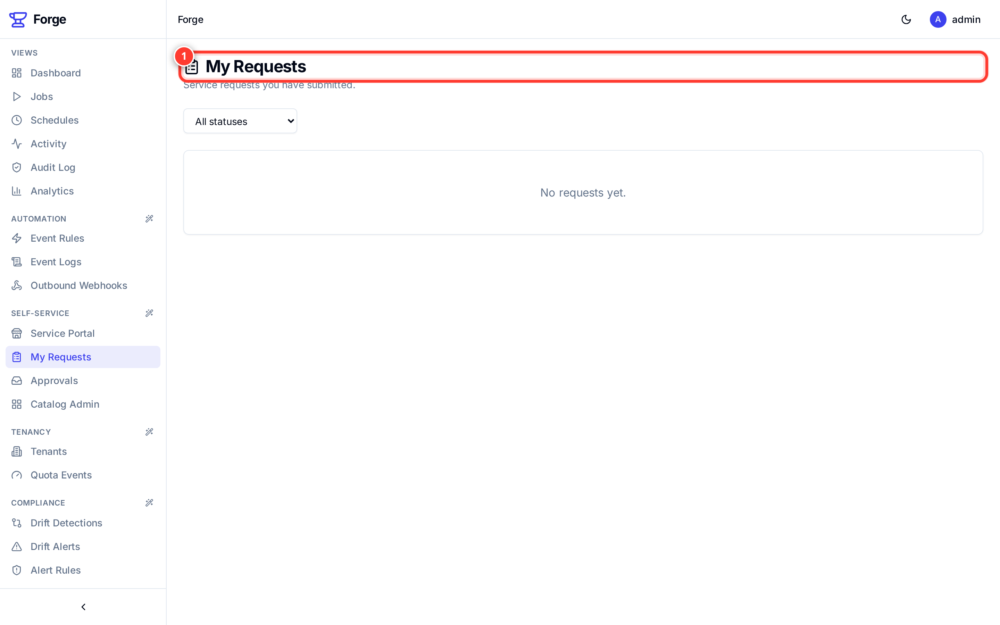

**What each marker means:**

1. **Page heading** — your submitted requests with their current status.

Tracks the status of requests you submitted from the Service Portal.

**Step by step**

1. Click **My Requests**.
2. Read the status column: `pending`, `approved`, `rejected`, `running`, `completed`, `failed`.
3. Click any row → **Output** tab to read the job log.

**Example**

> Submit a *New Dev VM* request → open **My Requests** → wait for `approved` → wait for `completed` → copy the VM IP from output.

---

## Approvals

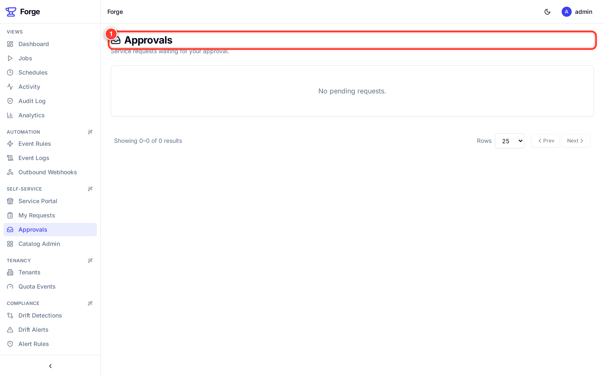

**What each marker means:**

1. **Page heading** — pending requests waiting for an approver. Click a row to read details and Approve / Reject.

Queue of items waiting for an approver. Items appear here when a Service Portal entry is configured to require approval.

**Step by step (as approver)**

1. Click **Approvals**.
2. Click a pending item.
3. Read the request details and the requester comment.
4. Click **Approve** or **Reject**. If rejecting, provide a reason.

**Example**

> Open the queue → click `Provision Production DB` → review parameters → click **Approve** → job auto-launches.

---

## Catalog Admin

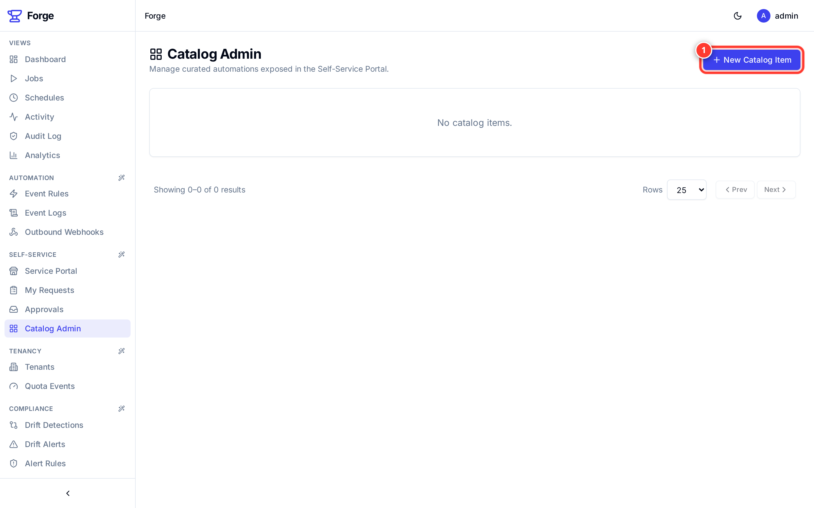

**What each marker means:**

1. **Add Item** — opens the form below.

Where admins create and manage Service Portal entries.

**Create Catalog Item**

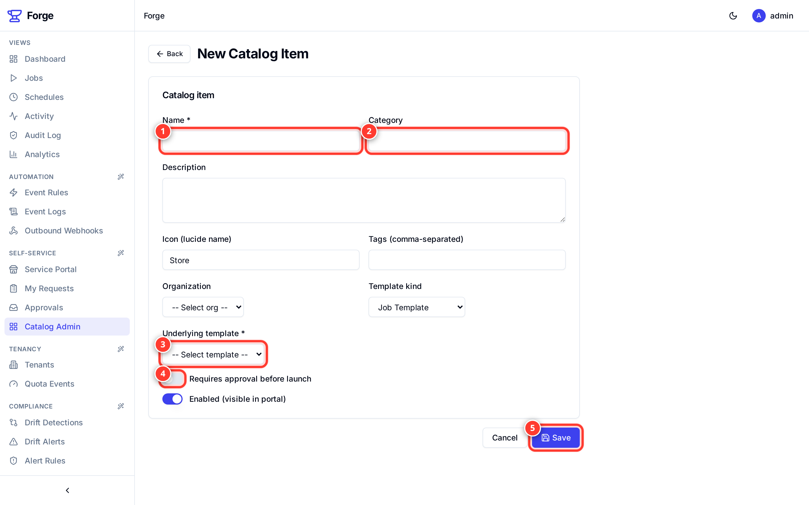

**What each marker means:**

1. **Name** — what end users will see in the Service Portal, e.g. `New Dev VM`.
2. **Category** — groups items in the portal, e.g. `Compute`.
3. **Underlying template** — the Job Template that will run when a request is approved.
4. **Requires approval** — toggle on to route requests through Approvals; off to auto-launch.
5. **Save** — publishes the catalog item.

**Step by step**

1. Click **Catalog Admin** → **Add Item**.
2. Fill in:
   - **Title**
   - **Description**
   - **Category**
   - **Underlying Job Template**
   - **Survey form**
   - **Approval required?** (yes / no — pick approver group)
3. Click **Publish**.

**Example**

| Field | Value |
|---|---|
| Title | New Dev VM |
| Category | Compute |
| Template | `Provision VM` |
| Approval required | No |

---

# TENANCY

## Tenants

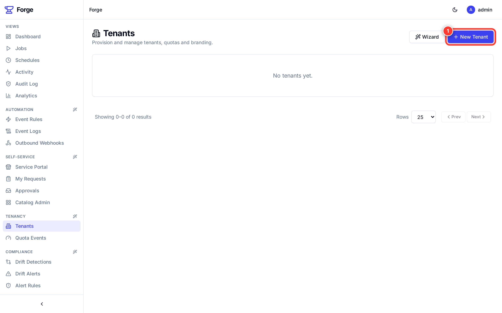

**What each marker means:**

1. **Create Tenant** — opens the form below.

A tenant is an isolated workspace (org-of-orgs) with its own data, quotas, and members. Used for multi-tenant deployments.

**Create Tenant**

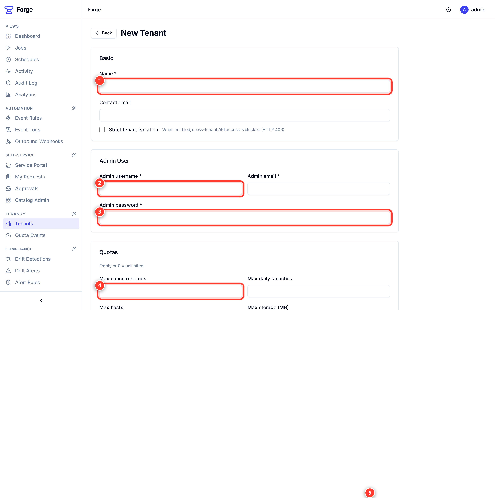

**What each marker means:**

1. **Name** — slug-friendly id, e.g. `acme-corp`.
2. **Admin username** — bootstrap admin login for the tenant, e.g. `acme-admin`.
3. **Admin password** — strong password for the bootstrap admin.
4. **Max concurrent jobs** — quota cap for parallel jobs, e.g. `20`.
5. **Save** — provisions the tenant atomically (org + admin + team + quotas).

**Step by step**

1. Click **Tenants** → **Create Tenant**.
2. Fill in:
   - **Name** — slug-friendly
   - **Display Name**
   - **Quota** — max jobs/day, max hosts, max storage
   - **Owner user**
3. Click **Create**.

**Example**

```yaml
name: acme-corp
display_name: ACME Corp
quota:
  jobs_per_day: 500
  hosts: 200
  storage_gb: 50
owner: acme-admin@example.com
```

---

## Quota Events

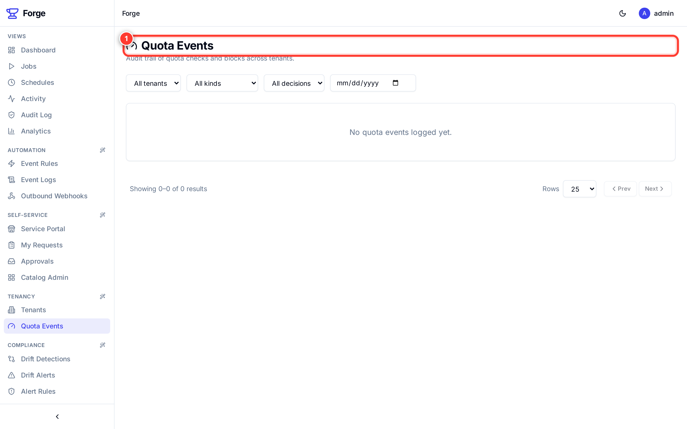

**What each marker means:**

1. **Page heading** — read-only audit feed of quota changes and quota-exceeded events.

Audit feed of quota changes and quota-exceeded events per tenant.

**Step by step**

1. Click **Quota Events**.
2. Filter by **Tenant** and **Event Type** (`exceeded`, `raised`, `lowered`).
3. Click a row to see the resource that hit the limit.

**Example**

> Filter: Tenant = `acme-corp`, Event = `exceeded` → see when ACME hit their daily job ceiling → contact them or raise the quota.

---

# COMPLIANCE

## Drift Detections

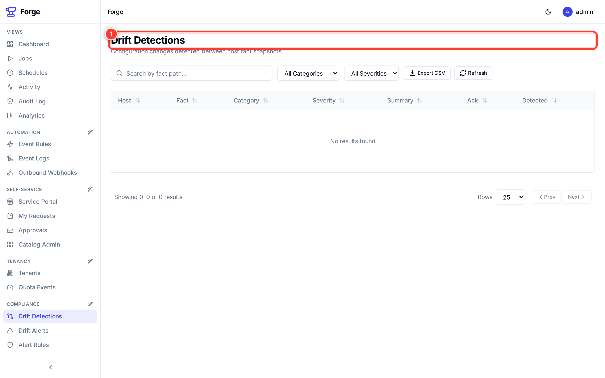

**What each marker means:**

1. **Page heading** — list of drift detection runs. Click any row for the per-host findings.

Compares the current state of a host against a known-good fact baseline.

**Step by step**

1. Click **Drift Detections** → **Run Detection**.
2. Pick:
   - **Inventory**
   - **Baseline snapshot**
   - **Hosts** (or *All*)
3. Click **Run**.
4. Open the result row when finished.

**Example**

> Inventory: `prod-web` · Baseline: `baseline-2026-04-01` · Hosts: All → Run.

---

## Drift Alerts

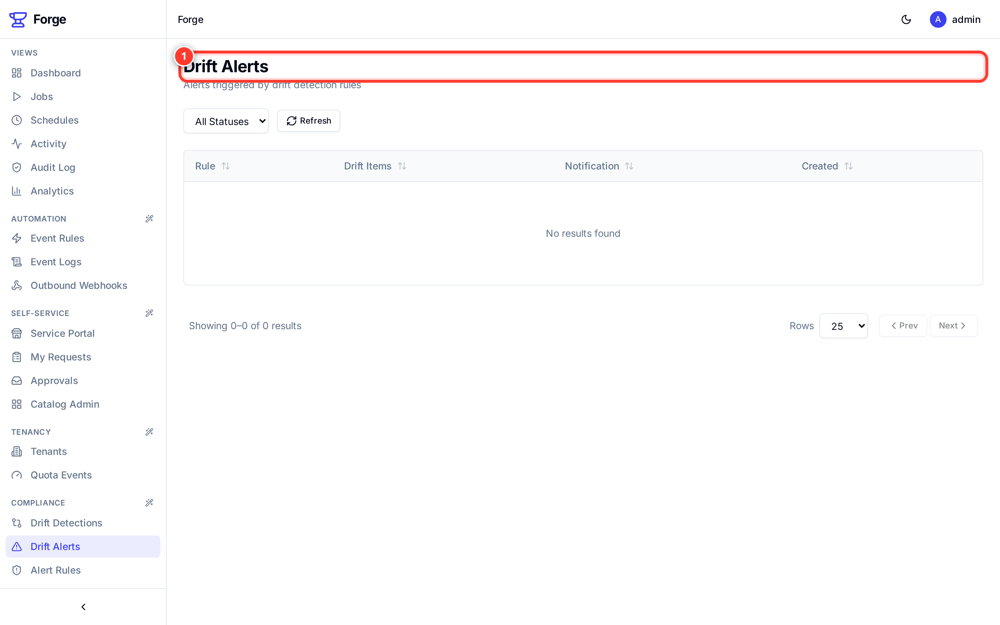

**What each marker means:**

1. **Page heading** — open alerts opened by drift detections. Use status filter to narrow by `open` / `acked` / `resolved`.

Alerts opened automatically when a drift detection finds a mismatch.

**Step by step**

1. Click **Drift Alerts**.
2. Filter by **Severity** (`info`, `warn`, `crit`) or **Status** (`open`, `acked`, `resolved`).
3. Open an alert → click **Acknowledge** or **Resolve**.

**Example**

> Filter: Severity = `crit`, Status = `open` → ack each one → assign to oncall.

---

## Alert Rules

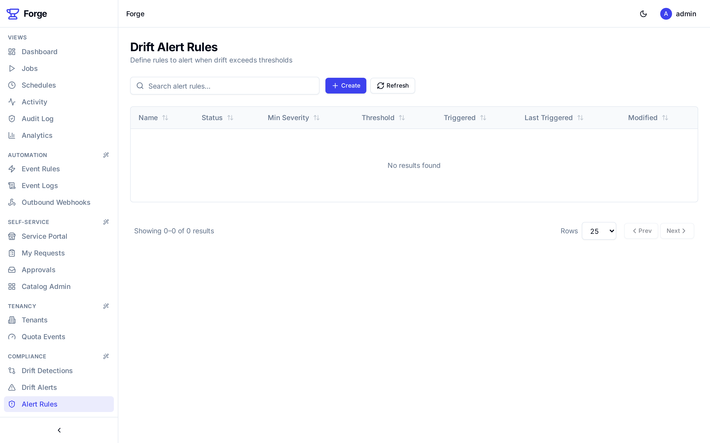

**What each marker means:**

1. **Create Alert Rule** — opens the form below.

Rules that decide which drift findings become alerts and at which severity.

**Create Alert Rule**

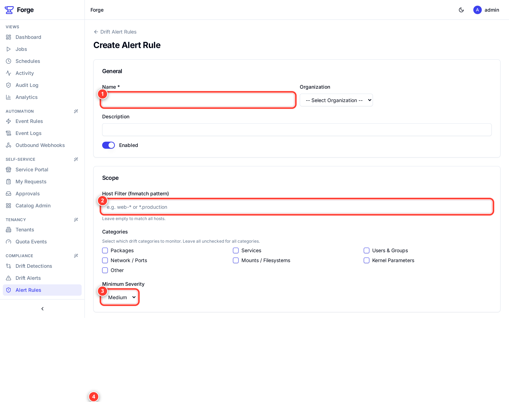

**What each marker means:**

1. **Name** — short id, e.g. `ssh-port-must-be-22`.
2. **Host Filter** — fnmatch pattern (e.g. `prod-*`) to scope the rule.
3. **Minimum Severity** — info / warn / crit — minimum severity that opens an alert.
4. **Create Alert Rule** — submits the form.

**Step by step**

1. Click **Alert Rules** → **Add Rule**.
2. Fill in:
   - **Name**
   - **Match** (fact key + expected value or regex)
   - **Severity**
   - **Notify** (which Notification target)
3. **Save**.

**Example**

```yaml
name: ssh-port-must-be-22
match:
  fact: ansible_facts.ssh.port
  not_equal: 22
severity: crit
notify: slack-secops
```

---

## Fact Snapshots

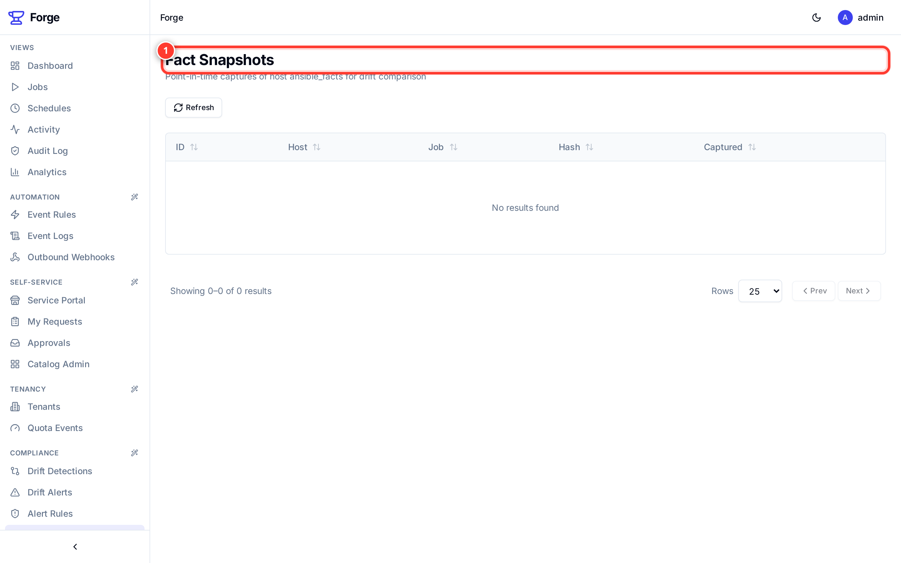

**What each marker means:**

1. **Page heading** — list of point-in-time fact captures used as drift baselines.

A point-in-time capture of host facts. Used as drift baselines.

**Step by step**

1. Click **Fact Snapshots** → **Create Snapshot**.
2. Pick **Inventory** and **Hosts**.
3. Add a **Label** (the snapshot’s name).
4. Click **Capture**.

**Example**

| Field | Value |
|---|---|
| Inventory | `prod-web` |
| Hosts | All |
| Label | `baseline-2026-04-01` |

---

## Policies

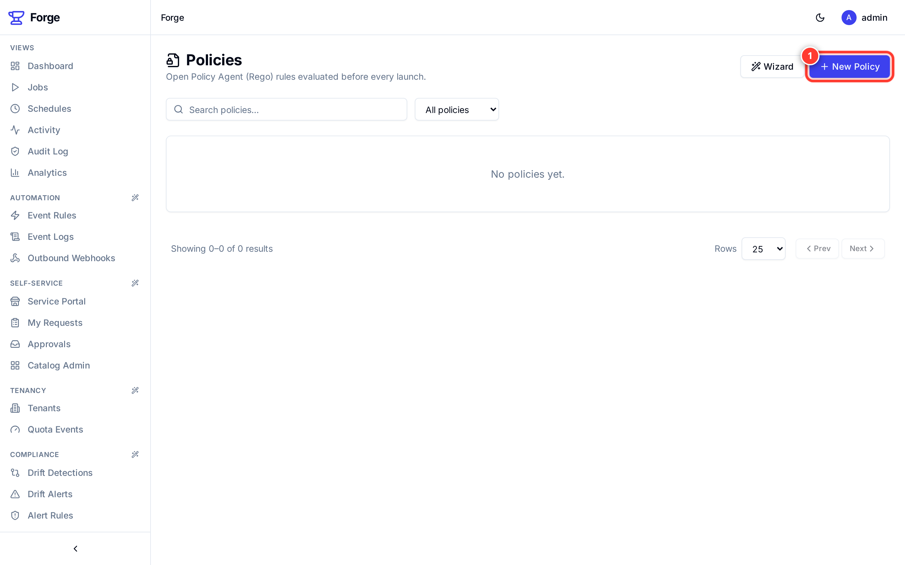

**What each marker means:**

1. **Create Policy** — opens the form below.

Policy-as-Code rules (OPA / Rego) that gate job execution and approvals.

**Create Policy**

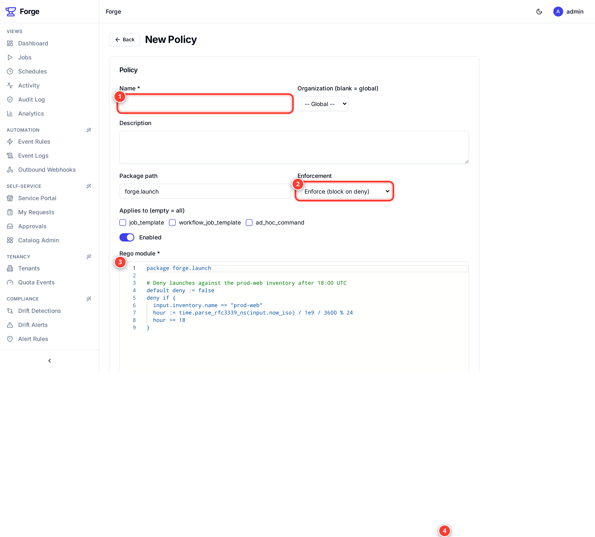

**What each marker means:**

1. **Name** — short id, e.g. `dba-only-drop-db`.
2. **Enforcement** — `enforce` (block on deny) or `warn` (record only).
3. **Rego module** — the OPA Rego source that returns deny / allow.
4. **Save** — validates and stores the policy.

**Step by step**

1. Click **Policies** → **Create Policy**.
2. Fill in:
   - **Name**
   - **Scope** (`pre-job`, `pre-approval`, `pre-deploy`)
   - **Rego source**
3. Click **Validate** → **Save** → **Enable**.

**Example Rego**

```rego
package forge.prejob

deny[msg] {
  input.template.name == "Drop Database"
  input.user.team != "dba"
  msg := "only DBAs can drop databases"
}
```

---

## Policy Decisions

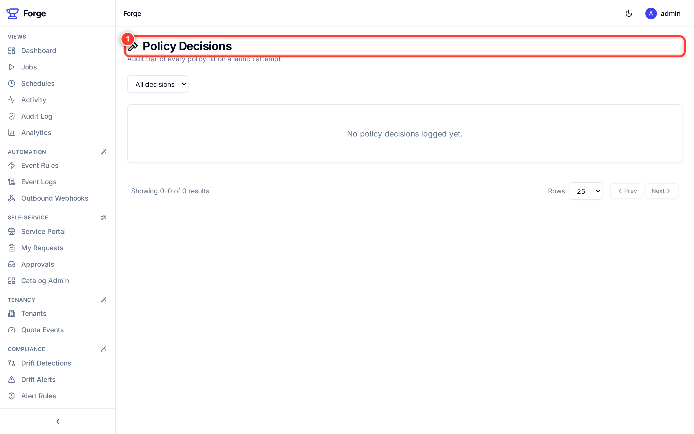

**What each marker means:**

1. **Page heading** — read-only history of every OPA evaluation. Filter by Verdict / User / Policy.

History of every policy evaluation: who triggered it, what the input was, and the verdict.

**Step by step**

1. Click **Policy Decisions**.
2. Filter by **Policy**, **Verdict** (`allow` / `deny`), **User**.
3. Click a row to see the full input JSON and the rule that fired.

**Example**

> Filter: Verdict = `deny`, Last 24h → see who got blocked yesterday and why.

---

## Scanners

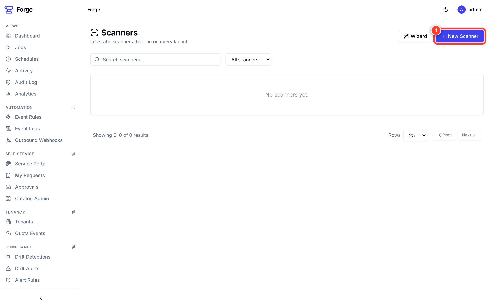

**What each marker means:**

1. **Create Scanner** — opens the form below.

Configured IaC / image / dependency scanners (Trivy, Checkov, …).

**Create Scanner**

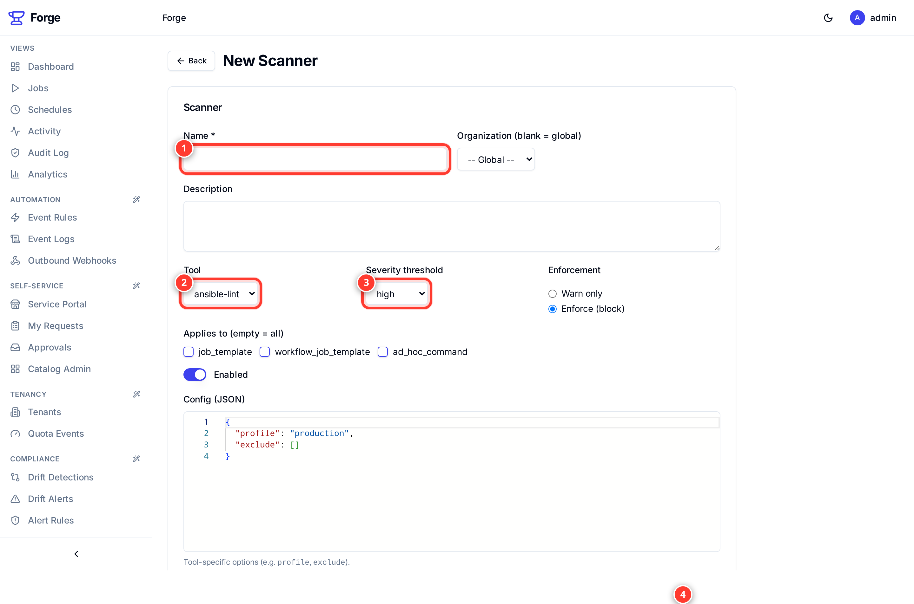

**What each marker means:**

1. **Name** — short id, e.g. `trivy-prod`.
2. **Tool** — Trivy / Checkov / ansible-lint / pip-audit.
3. **Severity threshold** — minimum severity that fails a job, e.g. `high`.
4. **Save** — registers the scanner.

**Step by step**

1. Click **Scanners** → **Add Scanner**.
2. Fill in:
   - **Type** (Trivy / Checkov / Custom)
   - **Target** (Project, Inventory, or Image registry)
   - **Schedule** (cron)
3. **Save** → click **Run Now** to test.

**Example**

| Field | Value |
|---|---|
| Type | Trivy |
| Target | Project: `infra-terraform` |
| Schedule | `0 3 * * *` |

---

## Scan Results

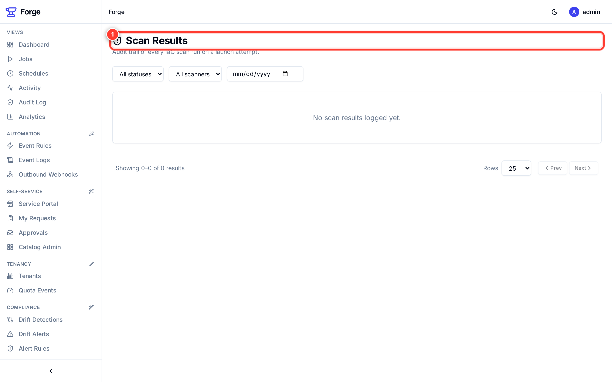

**What each marker means:**

1. **Page heading** — read-only findings from configured scanners. Filter by severity / scanner / date.

Findings from the configured scanners.

**Step by step**

1. Click **Scan Results**.
2. Filter by **Severity** (`crit`, `high`, `med`, `low`), **Scanner**, **Date**.
3. Click a finding for the file path, line number, and remediation hint.
4. Click **Mark as Fixed** after remediating.

**Example**

> Filter: Severity = `crit`, Scanner = `trivy` → triage every critical CVE.

---

## Observability

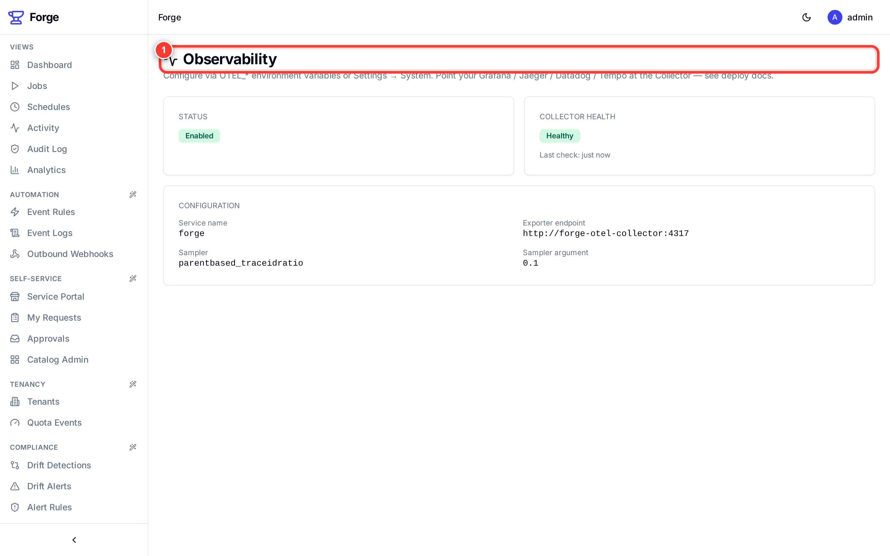

**What each marker means:**

1. **Page heading** — live OpenTelemetry view (traces, metrics, logs). Pick a tab and search.

Live OpenTelemetry view of the platform itself: traces, metrics, logs.

**Step by step**

1. Click **Observability**.
2. Pick a tab: **Traces**, **Metrics**, **Logs**.
3. Use the search bar (Trace ID / Service / Metric name).
4. Click **Open in Grafana** for the deep view.

**Example**

> Tab: Traces → search `service=forge-web` → click the slowest span → open in Grafana.

---

# RESOURCES

## Templates

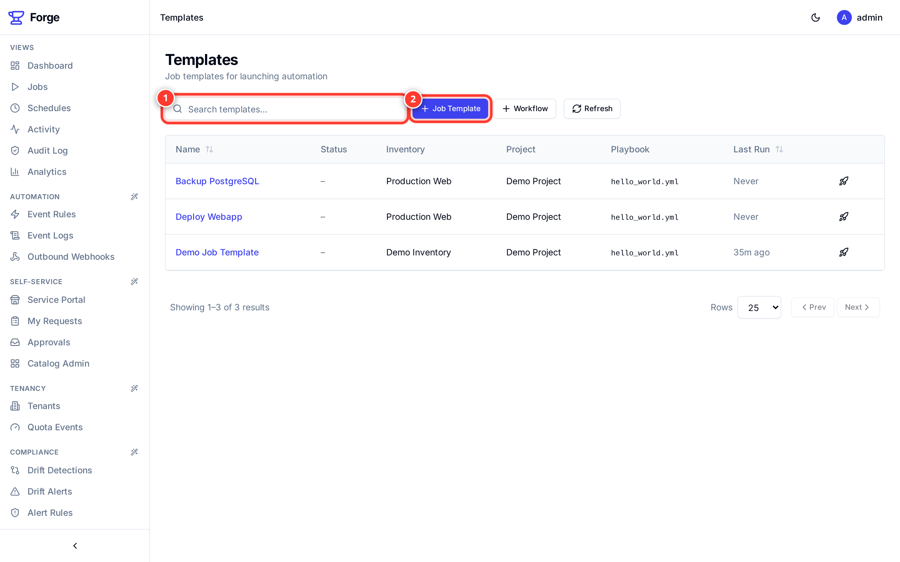

**What each marker means:**

1. **Search box** — filter templates by name, e.g. type `Deploy`.
2. **+ Job Template** — opens the create form below.

Job Templates wrap a project + playbook + inventory + credentials + survey into a launchable unit.

**Create Job Template**

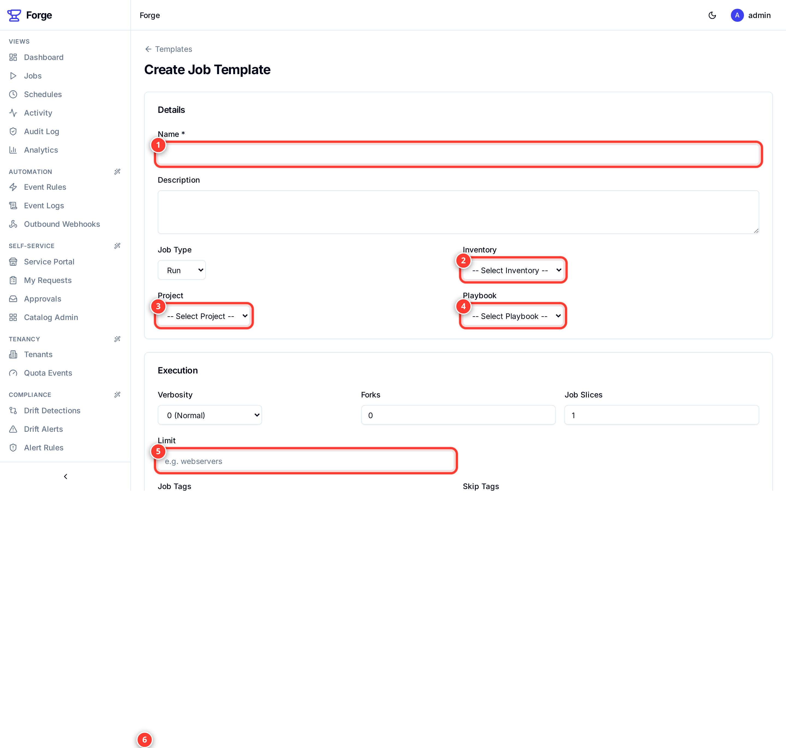

**What each marker means:**

1. **Name** — short, descriptive id, e.g. `Deploy Webapp`.
2. **Inventory** — pick the target hosts, e.g. `Production Web`.
3. **Project** — the Git project that contains the playbook, e.g. `Demo Project`.
4. **Playbook** — the YAML file inside the project to run, e.g. `deploy.yml`.
5. **Limit** — host pattern to scope the run, e.g. `webservers` or `webservers:!web03`.
6. **Create Template** — submits the form.

**Step by step**

1. Click **Templates** → **Add Job Template**.
2. Fill in:
   - **Name**
   - **Job Type** (`run` / `check`)
   - **Inventory**
   - **Project**
   - **Playbook**
   - **Credentials**
   - **Limit** (host pattern, optional)
   - **Variables** (YAML / JSON)
3. **Save** → click **Launch** to test.

**Example**

```yaml
name: deploy-webapp
job_type: run
inventory: prod-web
project: webapp-iac
playbook: deploy.yml
credentials:
  - ssh-prod
limit: webservers
variables:
  app_version: 2.3.1
```

---

## Inventories

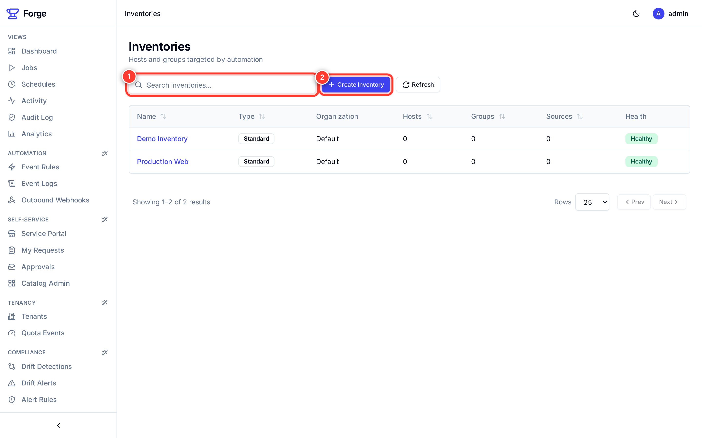

**What each marker means:**

1. **Search box** — filter the inventories list.
2. **Create Inventory** — opens the form below.

Logical group of hosts. May be static, sourced from a file, or synced from a cloud (AWS / Azure / GCP).

**Create Inventory**

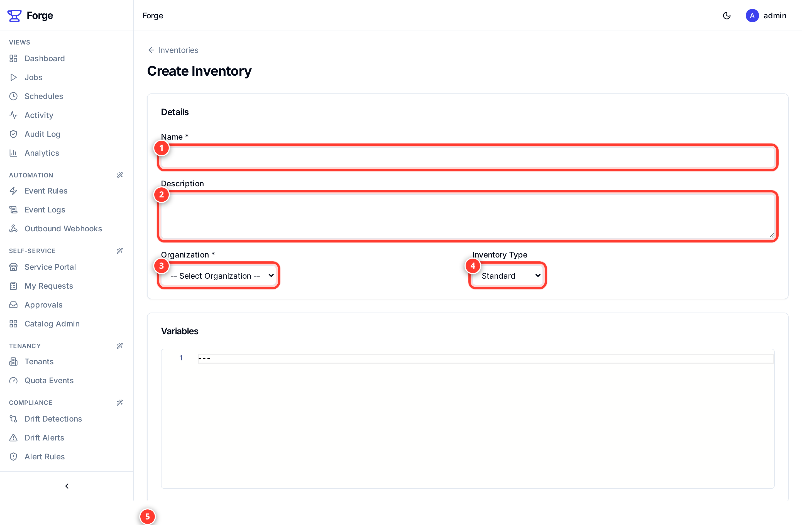

**What each marker means:**

1. **Name** — short id, e.g. `Production Web`.
2. **Description** — free-text purpose, e.g. `Web tier — production hosts`.
3. **Organization** — which org owns this inventory, e.g. `Default`.
4. **Inventory Type** — `Standard` for a static list, `Smart` for a dynamic host filter.
5. **Create Inventory** — submits the form.

**Step by step — create static inventory**

1. Click **Inventories** → **Add → Inventory**.
2. Fill in **Name**, **Organization**, **Description**.
3. Click **Save**.
4. Open the **Hosts** tab → **Add** to attach hosts.
5. Open the **Groups** tab → **Add** to organize hosts.

**Example**

| Field | Value |
|---|---|
| Name | `prod-web` |
| Organization | Platform |
| Hosts | `web01`, `web02`, `web03` |
| Group | `webservers` (contains all three) |

---

## Hosts

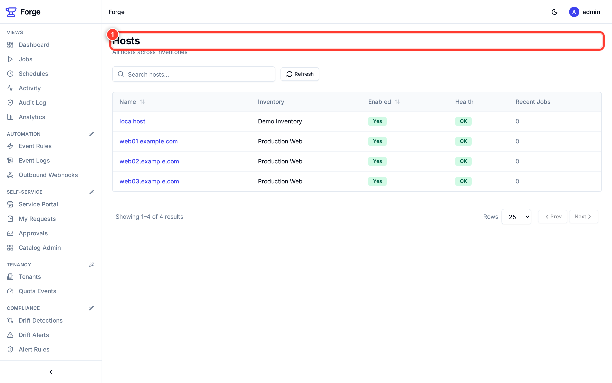

**What each marker means:**

1. **Page heading** — flat list of all hosts across all inventories. Click a host to see its facts and group memberships.

Individual machines (or endpoints) that belong to one or more inventories.

**Step by step**

1. Click **Hosts** → **Add**.
2. Fill in:
   - **Hostname / IP**
   - **Inventory**
   - **Variables** (YAML — host-specific overrides)
3. **Save**.

**Example**

```yaml
name: web01.example.com
inventory: prod-web
variables:
  ansible_user: deploy
  http_port: 8080
```

---

## Projects

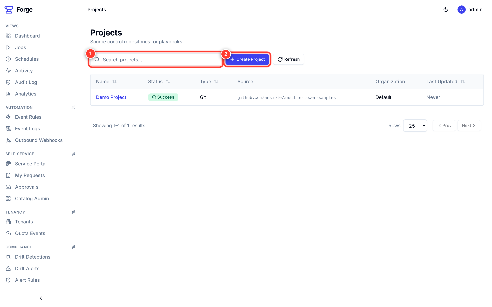

**What each marker means:**

1. **Search box** — filter projects by name.
2. **Create Project** — opens the form below.

A Project is a Git checkout containing playbooks, roles, and collections.

**Create Project**

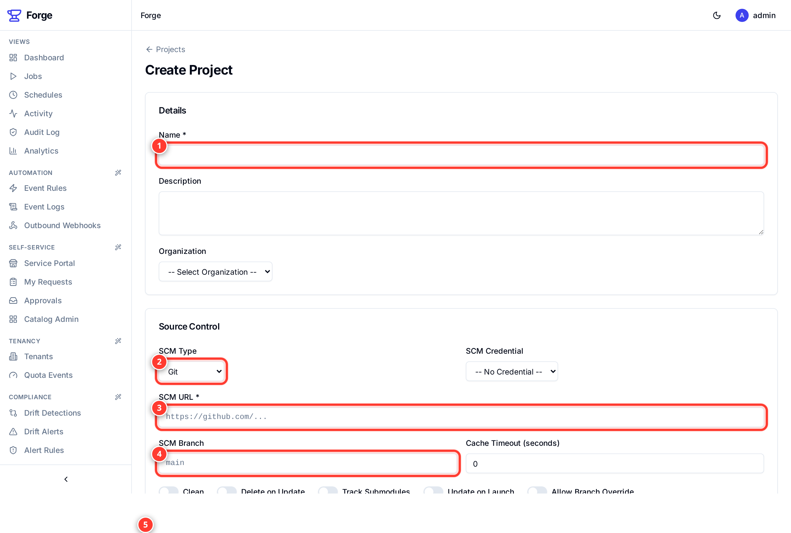

**What each marker means:**

1. **Name** — short id, e.g. `webapp-iac`.
2. **SCM Type** — `git` (GitHub / GitLab / Bitbucket / self-hosted).
3. **SCM URL** — clone URL, e.g. `git@github.com:acme/webapp-iac.git`.
4. **SCM Branch** — branch / tag / sha to check out, e.g. `main`.
5. **Create Project** — submits the form and triggers the first sync.

**Step by step**

1. Click **Projects** → **Add**.
2. Fill in:
   - **Name**
   - **Organization**
   - **SCM Type** (`git`)
   - **SCM URL**
   - **SCM Branch**
   - **SCM Credential**
   - **Update Options** (clean, delete on update, update on launch)
3. **Save**. The first sync starts automatically.

**Example**

| Field | Value |
|---|---|
| Name | webapp-iac |
| SCM Type | git |
| URL | `git@github.com:acme/webapp-iac.git` |
| Branch | main |
| Credential | `github-deploy-key` |

---

## Credentials

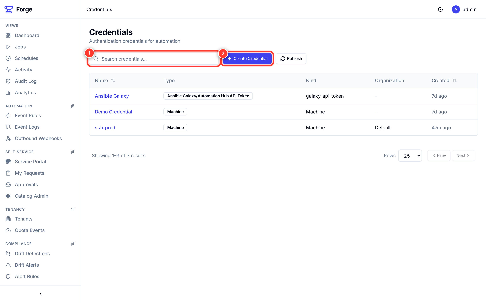

**What each marker means:**

1. **Search box** — filter credentials.
2. **Create Credential** — opens the form below.

Encrypted secret store: SSH keys, passwords, cloud tokens, vault keys.

**Create Credential**

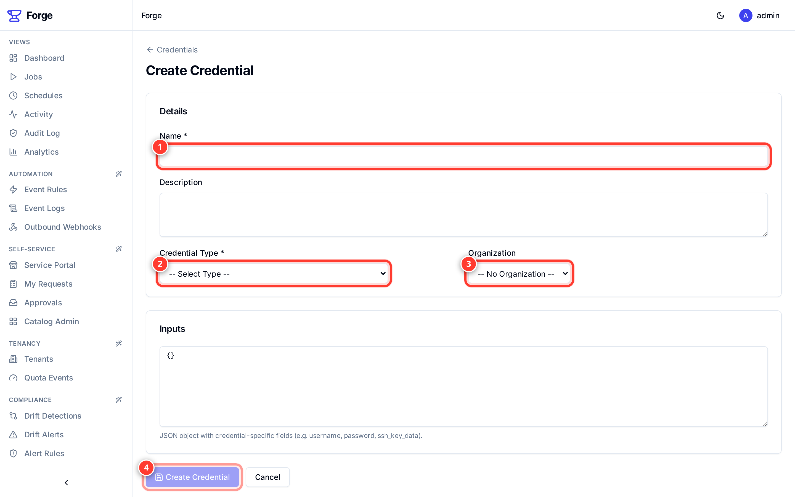

**What each marker means:**

1. **Name** — short id, e.g. `ssh-prod`.
2. **Credential Type** — Machine / SCM / Vault / AWS / Azure / GCP / etc.
3. **Organization** — which org owns this credential.
4. **Create Credential** — submits the form (encrypted at rest).

**Step by step**

1. Click **Credentials** → **Add**.
2. Pick a **Credential Type** (Machine, Source Control, Vault, AWS, Azure, GCP, …).
3. Fill in the required fields (varies by type).
4. **Save** — the secret is encrypted at rest.

**Example — SSH key for production**

| Field | Value |
|---|---|
| Name | `ssh-prod` |
| Type | Machine |
| Username | `deploy` |
| SSH Private Key | *(paste key)* |
| Privilege Escalation | sudo |

---

# ACCESS

## Organizations

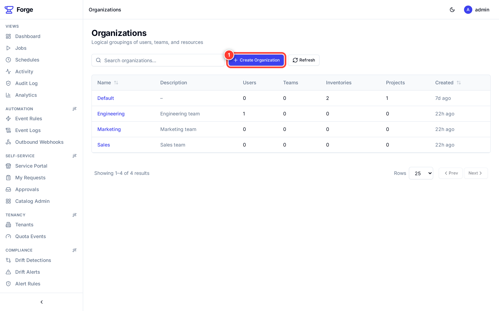

**What each marker means:**

1. **Create Organization** — opens the form below.

Top-level container for users, teams, projects, inventories, templates.

**Create Organization**

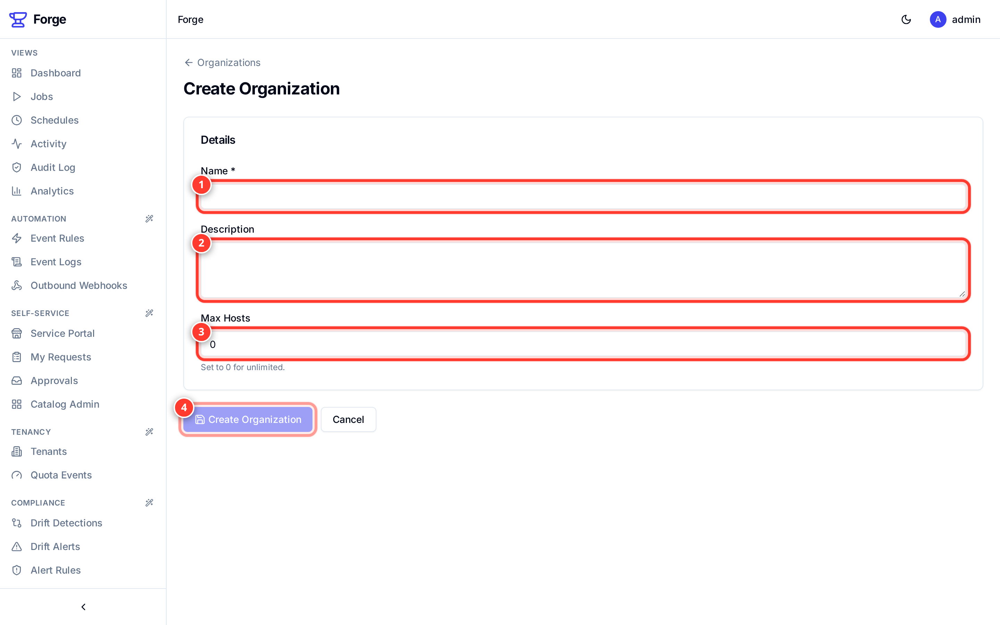

**What each marker means:**

1. **Name** — short id, e.g. `Platform`.
2. **Description** — purpose of the org, e.g. `Core platform engineering org`.
3. **Max Hosts** — soft cap for the org, leave 0 for unlimited.
4. **Create Organization** — submits the form.

**Step by step**

1. Click **Organizations** → **Add**.
2. Fill in **Name** and **Description**.
3. **Save**.
4. Open the org → **Access** tab → add users / teams.

**Example**

> Name: `Platform` · Description: `Core platform engineering org`.

---

## Users

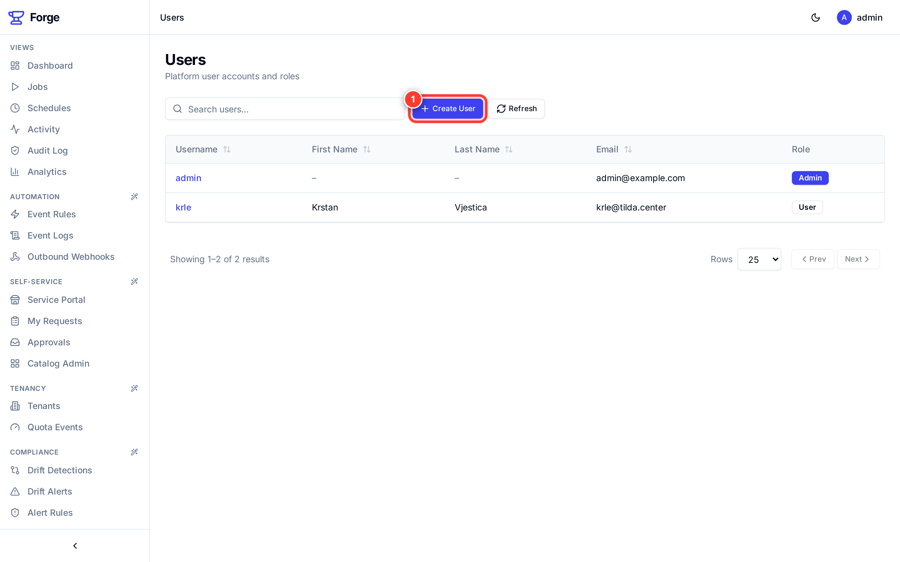

**What each marker means:**

1. **Create User** — opens the form below.

Local and SSO-mapped users.

**Create User**

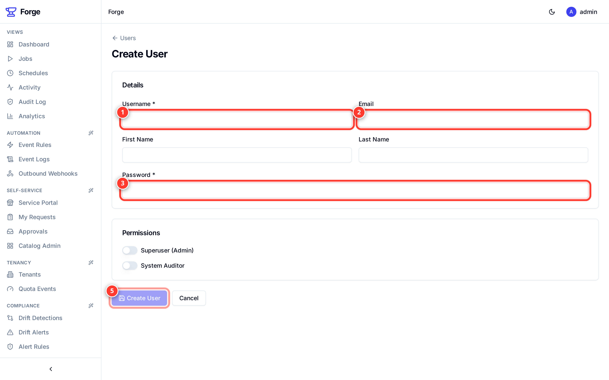

**What each marker means:**

1. **Username** — login id, e.g. `alice`.
2. **Email** — contact address, e.g. `alice@example.com`.
3. **Password** — strong initial password (user can change later).
4. **Superuser toggle** — grants full admin rights; leave off for normal users.
5. **Create User** — submits the form.

**Step by step — create a local user**

1. Click **Users** → **Add**.
2. Fill in **Username**, **Email**, **First / Last name**, **Password**.
3. Pick **User Type** (Normal / System Auditor / System Admin).
4. **Save**.
5. Open the user → **Permissions** → grant role on objects.

**Example**

| Field | Value |
|---|---|
| Username | `alice` |
| Email | `alice@example.com` |
| User Type | Normal |
| Role | `Project Admin` on `webapp-iac` |

---

## Teams

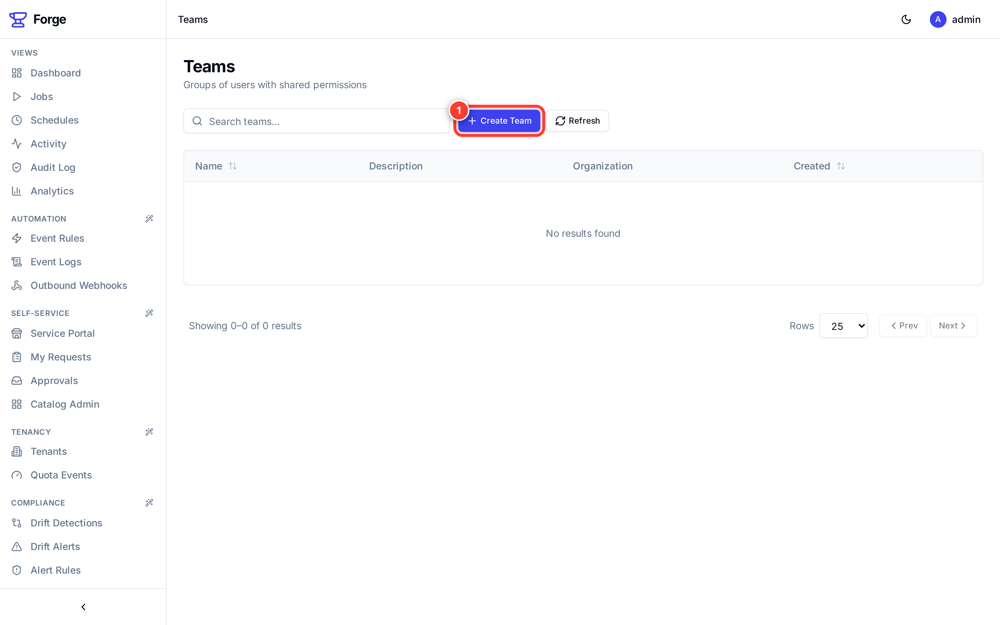

**What each marker means:**

1. **Create Team** — opens the form below.

A Team groups users so permissions can be granted in bulk.

**Create Team**

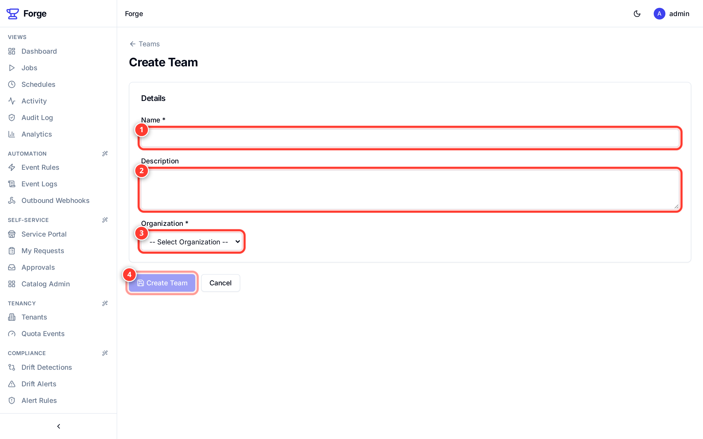

**What each marker means:**

1. **Name** — short id, e.g. `webapp-devs`.
2. **Description** — purpose, e.g. `Engineers who deploy the webapp`.
3. **Organization** — parent org for the team.
4. **Create Team** — submits the form.

**Step by step**

1. Click **Teams** → **Add**.
2. Fill in **Name**, **Organization**, **Description**.
3. **Save**.
4. Open the team → **Access** tab → add members.
5. Grant the team a role on a project / template / inventory.

**Example**

> Team: `webapp-devs` · Org: `Platform` · Members: `alice`, `bob` · Role: `Execute` on template `deploy-webapp`.

---

# ADMIN

## Instances

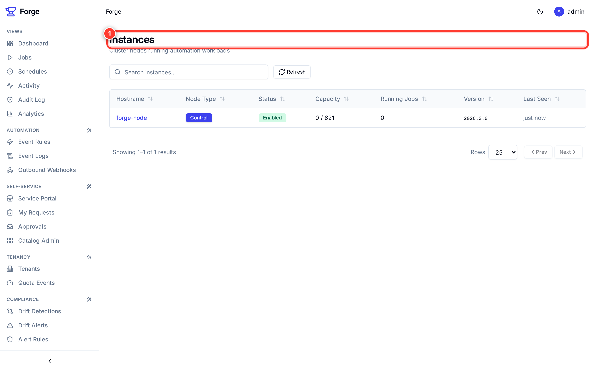

**What each marker means:**

1. **Page heading** — list of cluster nodes. Click any row to enable / disable a node or adjust its capacity.

Physical or virtual nodes that run jobs (control plane + execution plane).

**Step by step**

1. Click **Instances**.
2. Read the table: **Hostname**, **Node Type**, **Capacity**, **Used**, **Status**.
3. Click an instance → **Disable** (drain) or **Enable**.

**Example**

> Drain `worker-03` before reboot → mark Disabled → wait for jobs to drain → reboot → mark Enabled.

---

## Instance Groups

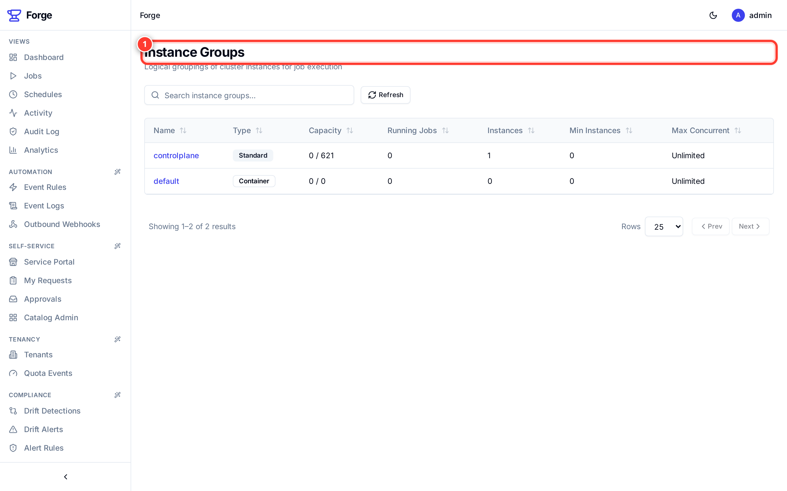

**What each marker means:**

1. **Page heading** — logical pools of instances. Click a group to manage members and policy.

Logical pools of instances. Templates can be pinned to a group (e.g., `gpu-pool`, `eu-west-pool`).

**Step by step**

1. Click **Instance Groups** → **Add**.
2. Fill in **Name** and **Policy** (min instances, max idle).
3. **Save**.
4. Open the group → **Instances** tab → attach instances.
5. Open a Job Template → set its **Instance Group** to this one.

**Example**

| Field | Value |
|---|---|
| Name | `eu-west-pool` |
| Policy instances minimum | 2 |
| Members | `worker-eu-01`, `worker-eu-02` |

---

## Execution Environments

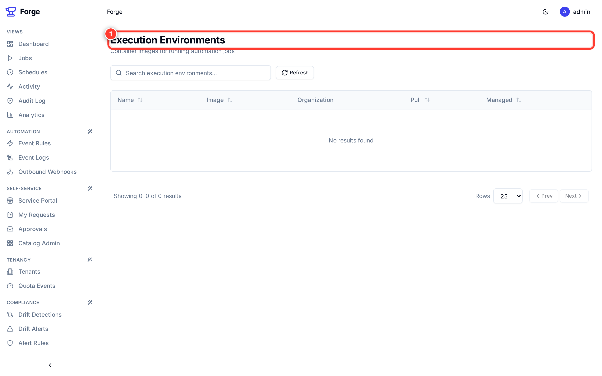

**What each marker means:**

1. **Page heading** — container images that hold the runtime for jobs. Click any row to edit pull policy or registry credential.

Container images that hold the runtime (Python, collections, binaries) used to run jobs.

**Step by step**

1. Click **Execution Env** → **Add**.
2. Fill in:
   - **Name**
   - **Image** (`registry/repo:tag`)
   - **Pull Policy** (`always` / `missing` / `never`)
   - **Registry credential**
3. **Save**.
4. Reference it from a Job Template’s **Execution Environment** field.

**Example**

```yaml
name: ee-aws-2026.04
image: registry.example.com/forge/ee-aws:2026.04
pull: always
credential: harbor-pull
```

---

## Notifications

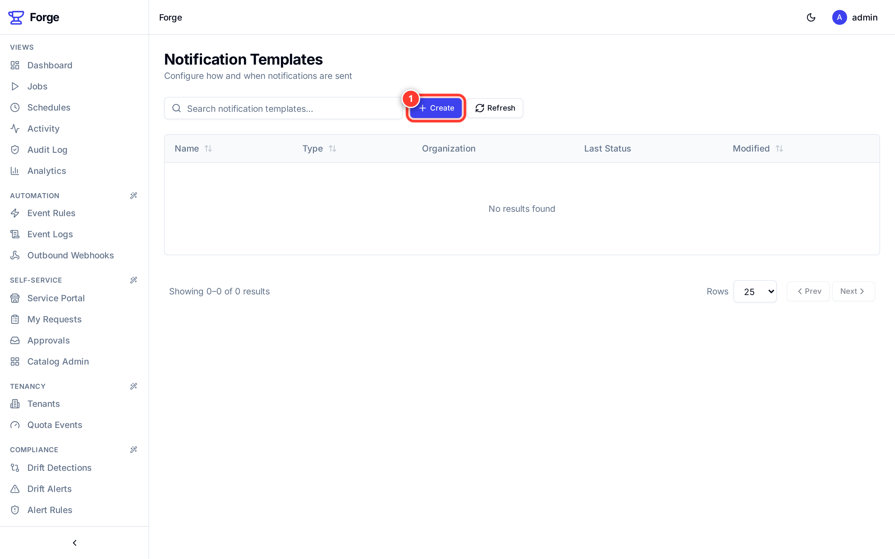

**What each marker means:**

1. **Create** — opens the form below.

Channels Forge can send messages to (email, Slack, PagerDuty, MS Teams, webhooks).

**Create Notification Template**

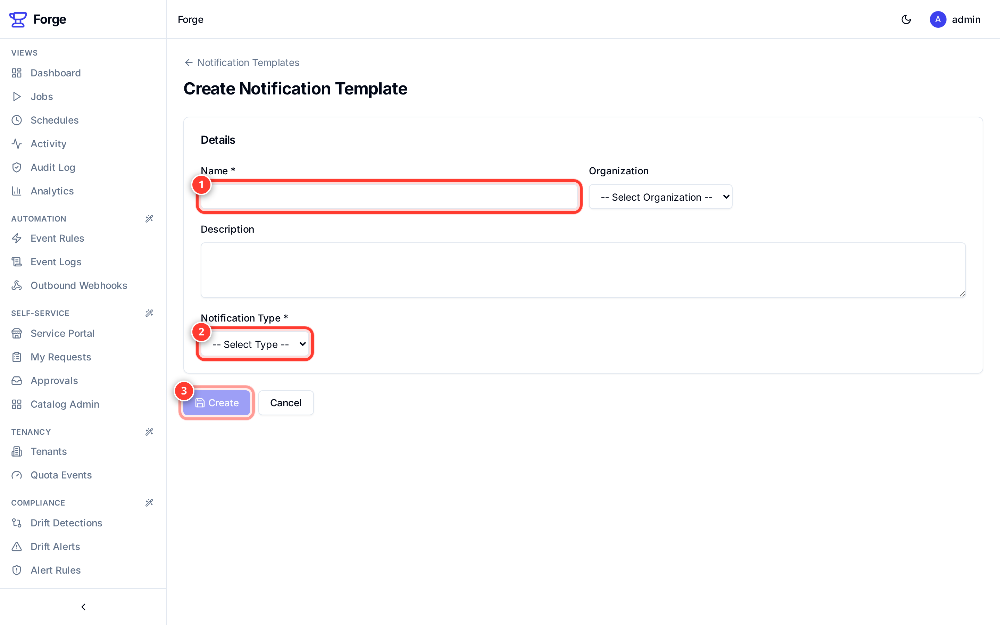

**What each marker means:**

1. **Name** — short id, e.g. `slack-secops`.
2. **Notification Type** — Email / Slack / PagerDuty / Webhook / MS Teams / etc.
3. **Create** — submits the form (next step asks for type-specific fields like Slack token + channel).

**Step by step**

1. Click **Notifications** → **Add**.
2. Pick **Type** (Email / Slack / PagerDuty / Webhook / …).
3. Fill in the type-specific fields.
4. Click **Test** → **Save**.
5. Attach the notification to a Job Template, Project, or Workflow on its **Notifications** tab.

**Example — Slack**

| Field | Value |
|---|---|
| Name | `slack-secops` |
| Type | Slack |
| Token | `xoxb-…` |
| Channel | `#secops-alerts` |

---

## Topology

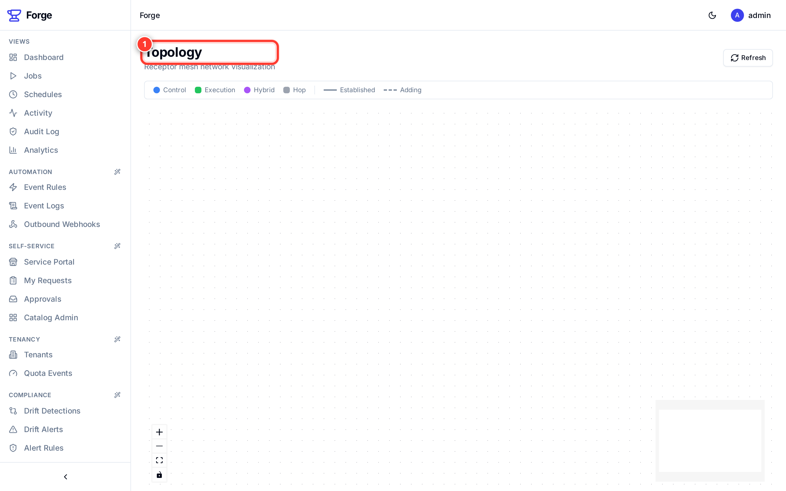

**What each marker means:**

1. **Page heading** — visual mesh map of the cluster. Drag to pan, scroll to zoom, click nodes / links for detail.

Visual map of the cluster: control nodes, hop nodes, execution nodes, mesh links.

**Step by step**

1. Click **Topology**.
2. Drag to pan, scroll to zoom.
3. Click any node for details (capacity, version, peers).
4. Click any link to see latency and link status.

**Example**

> Suspect a mesh issue → open Topology → spot a red link between `hop-eu` and `worker-eu-02` → click it → read the error.

---

## Settings

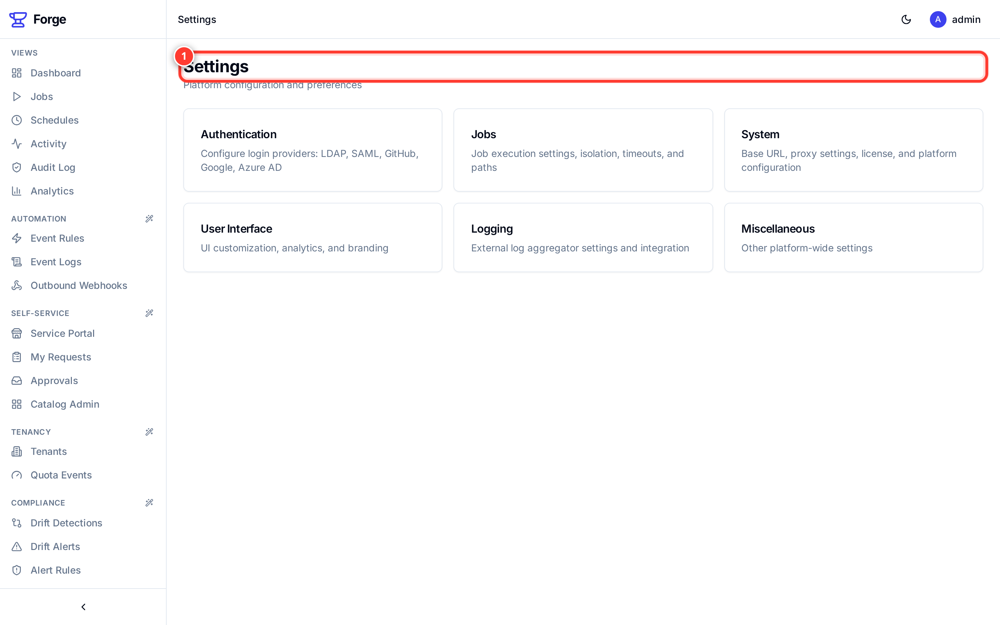

**What each marker means:**

1. **Page heading** — global platform configuration grouped by category (Authentication, System, Jobs, UI, Logging, License).

Global platform configuration: auth, system, jobs, UI, logging, license.

**Step by step**

1. Click **Settings**.
2. Pick a category (Authentication, System, Jobs, UI, Logging, License).
3. Edit the field, click **Save**.
4. Some changes (e.g., auth) require a service reload — banner will indicate.

**Example — bump max concurrent jobs**

> Settings → Jobs → set **Max Concurrent Jobs** to `200` → Save.

---

# Appendix — Common Workflows End-to-End

### A) Provision a new dev VM (self-service path)

1. [Catalog Admin](#catalog-admin) — admin publishes the *New Dev VM* item.
2. End user opens [Service Portal](#service-portal) → submits the form.
3. Item appears in [Approvals](#approvals) → approver approves.
4. Forge launches the [Templates](#templates) job behind the item.
5. End user watches it under [My Requests](#my-requests) and [Jobs](#jobs).

### B) Catch and fix configuration drift

1. Take a [Fact Snapshot](#fact-snapshots) of the production inventory.
2. Define an [Alert Rule](#alert-rules).
3. Run [Drift Detections](#drift-detections) on a schedule.
4. Mismatches open [Drift Alerts](#drift-alerts).
5. Fix via a [Templates](#templates) remediation job.

### C) Deploy a new release

1. Update playbooks in the Git repo behind your [Project](#projects).
2. Click **Sync** on the project.
3. Open the [Templates](#templates) deploy job → **Launch** with the new version variable.
4. Watch in [Jobs](#jobs).
5. Confirm in [Analytics](#analytics) → success rate stays green.

---

*End of handbook.*
